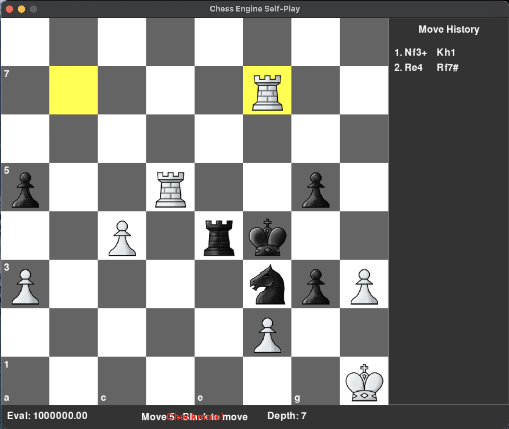

# Chess Engine with GUI

A chess engine implementation in Python featuring a graphical user interface built with Pygame. The engine uses alpha-beta pruning with various optimization techniques for move searching and evaluation.



## Features

### Engine
- Minimax search with alpha-beta pruning
- Iterative deepening
- Transposition table
- Killer moves heuristic
- Move ordering optimization
- Quiescence search
- Advanced position evaluation
- Configurable search depth

### GUI
- Real-time game visualization
- Move history display
- Current evaluation display
- Thinking time indicator
- Last move highlighting
- Adjustable search depth (using arrow keys)
- Game export in PGN format
- Chess.com compatible PGN export

## Requirements

```bash
python >= 3.8
pygame
python-chess
```

## Installation

1. Clone the repository:
```bash
git clone git@github.com:ishworii/Chess-Engine.git
cd Chess-Engine
```

2. Create and activate a virtual environment (optional but recommended):
```bash
python -m venv env
source env/bin/activate  # On Windows: env\Scripts\activate
```

3. Install dependencies:
```bash
pip install -r requirements.txt
```

## Usage

### Starting the GUI
```bash
python chess_board.py
```

### Controls
- **Up Arrow**: Increase search depth
- **Down Arrow**: Decrease search depth
- **Close Window**: End game and save PGN

### Custom Position
You can start from a custom position by modifying the FEN string in chess_board.py:
```python
fen = "your_fen_string_here"
board = chess.Board(fen=fen)
```

## Project Structure

```
chess-engine/
├── engine/
│   ├── __init__.py
│   ├── evaluate.py     # Position evaluation
│   └── search.py       # Move search implementation
├── images/             # Piece images
│   ├── bp.png
│   ├── bn.png
│   └── ...
├── games/             # Saved games in PGN format
├── chess_board.py     # GUI implementation
├── requirements.txt
└── README.md
```

## Engine Components

### Evaluation (evaluate.py)
- Material counting
- Piece-square tables
- Pawn structure evaluation
- King safety
- Piece mobility
- Position-specific bonuses

### Search (search.py)
- Alpha-beta pruning
- Move ordering
- Transposition table
- Killer moves
- Quiescence search
- Iterative deepening

## Game Export

Games are automatically saved in two formats:
- Standard PGN (games/game.pgn)
- Chess.com compatible PGN (games/chess_com_game.pgn)

## Contributing

Contributions are welcome! Here are some ways you can contribute:
- Improve engine strength
- Add new features
- Fix bugs
- Improve documentation
- Add tests

## Future Improvements

- [ ] Opening book implementation
- [ ] Endgame tablebases
- [ ] UCI protocol support
- [ ] Multi-threading support
- [ ] Neural network evaluation
- [ ] Time management improvements

